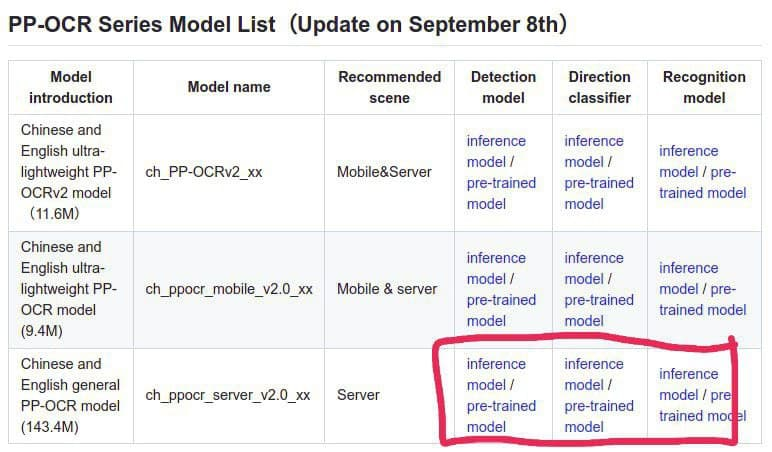

# Paddle OCR files

1.  Download the 3 files from [here](https://github.com/PaddlePaddle/PaddleOCR) as seen in the picture below.

    Note: Use the inference model

    

2. Create the 3 folders in `paddle_ocr` (`ch_ppocr_mobile_v2.0_cls_infer/`, `ch_ppocr_server_v2.0_det_infer/`, `ch_ppocr_server_v2.0_rec_infer/`). Unzip each zip file to the respective folder.

    - `Detection model` to `ch_ppocr_server_v2.0_det_infer/`

    - `Direction classfier` to `ch_ppocr_mobile_v2.0_cls_infer/`

    - `Recognition model` to `ch_ppocr_server_v2.0_rec_infer/`
